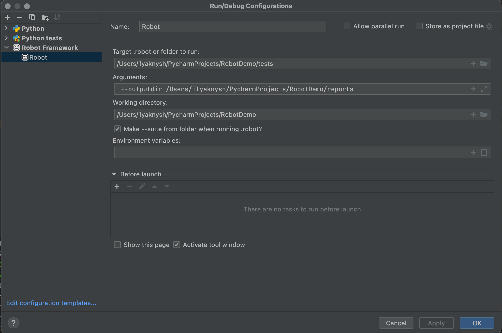

# RobotFramework Demo

## Prerequisites
1. Create and activate virtualenv
2. Install dependencies
3. Install Pycharm plugin Robot Framework Language Server
4. Set following settings in a plugin (Robot Framework (Project) in IDE settings):
   ```shell
   Language Server Python
   Python Executable
   Pythonpath 
   ```
5. Configure runner to make debug possible


## Run
It's possible to run tests through IDE interface or console by command
   ```shell
   robot {path_to_folder}
   ```
To run tests in parallel please use following command
   ```shell
   pabot {path_to_folder}
   ```